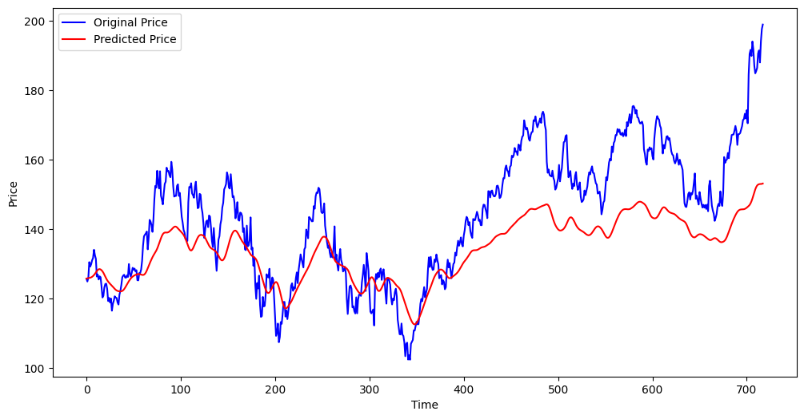

# Stock Price Prediction using LSTM

## Project Overview

The Stock Price Prediction project aims to predict the future stock prices of a selected company using Long Short-Term Memory (LSTM) neural networks. This project leverages historical stock price data and implements an LSTM model to forecast future prices. The entire project is executed in a Jupyter notebook, ensuring an interactive and comprehensive analysis.

## Project Workflow
- Data Collection: Obtaining historical stock price data for the selected company.
- Data Preprocessing: Cleaning the data, handling missing values, and normalizing the dataset.
- Model Building: Designing and building the LSTM model architecture.
- Model Training: Training the LSTM model on the historical stock price data.
- Model Evaluation: Evaluating the model's performance using appropriate metrics.
- Prediction: Using the trained model to predict future stock prices.
- Visualization: Generating visualizations to present the actual vs. predicted stock prices.

## Results

The project results include a trained LSTM model that reasonably predicts stock prices. The analysis will also provide visualizations comparing the actual and predicted stock prices, highlighting the model's performance.

## Contributing

Contributions to the Stock Price Prediction project are welcome. Feel free to open issues or submit pull requests with improvements or new features.

## License

This project is licensed under the MIT License.

## Acknowledgments

- The dataset used in this project is provided by Yahoo Finance or Alpha Vantage.
- This project is a part of the tasks provided by the internship at CodeAlpha.
